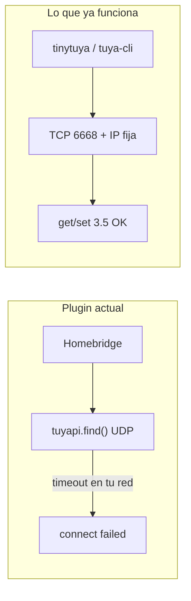
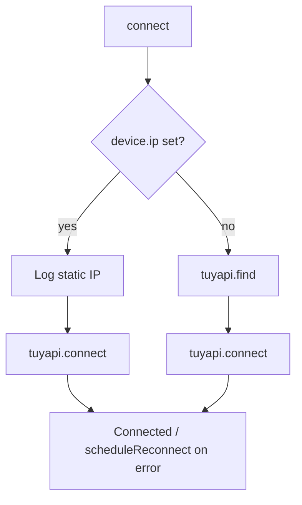

# Plan: Fork homebridge-create-fan con IP fija y publicación npm

## Contexto del problema



- Control local verificado: **protocolo 3.5**, IP `192.168.1.128`, `tinytuya set` enciende luz (DPS 20).
- Homebridge falla con `find() timed out` porque [`src/accessory.ts`](https://github.com/moifort/homebridge-create-fan/blob/master/src/accessory.ts) siempre ejecuta `find()` antes de `connect()` y **no pasa `ip`** al constructor de `tuyapi` (v7.7.1).
- `tinytuya scan` devuelve 0 dispositivos → el descubrimiento UDP no es fiable en tu LAN; la IP fija es el arreglo correcto.

## Objetivo del fork

1. Campo opcional **`ip`** por ventilador en config y UI (config.schema).
2. Si `ip` está definida: pasarla a `TuyAPI` y llamar **solo** `connect()` (sin `find()`).
3. Si `ip` no está definida: comportamiento actual (`find()` + `connect()`) para no romper instalaciones sin IP.
4. Al restaurar accesorios desde caché, **actualizar** `accessory.context.device` desde la config (hoy solo se asigna al crear accesorio nuevo; sin esto, añadir `ip` no surte efecto hasta borrar caché).
5. Publicar en **npm con nombre nuevo** (tu elección); mantener `PLATFORM_NAME` para que la clave `"platform": "HomebridgeCreateCeilingFan"` siga válida.

## Cambios de código (archivos del upstream)

Referencia upstream: [moifort/homebridge-create-fan](https://github.com/moifort/homebridge-create-fan) v2.0.25.

### 1. Tipos y plataforma — [`src/platform.ts`](https://github.com/moifort/homebridge-create-fan/blob/master/src/platform.ts)

- Añadir a `FanConfiguration`:

```typescript
ip?: string;  // IPv4 local, ej. "192.168.1.128"
```

- En `discoverDevices()`, al **restaurar** accesorio existente, fusionar config antes de instanciar `FanAccessory`:

```typescript
if (existingFan) {
  existingFan.context.device = { ...existingFan.context.device, ...fan };
  new FanAccessory(this, existingFan);
}
```

### 2. Conexión Tuya — [`src/accessory.ts`](https://github.com/moifort/homebridge-create-fan/blob/master/src/accessory.ts)

**Constructor `TuyAPI`** (~líneas 196–201):

```typescript
const device = accessory.context.device;
this.tuyaDevice = new TuyAPI({
  id: device.id,
  key: device.key,
  version: device.version ?? '3.4',
  issueRefreshOnConnect: true,
  ...(device.ip ? { ip: device.ip } : {}),
});
```

**Método `connect()`** (~líneas 241–256):

```typescript
const device = this.accessory.context.device;
if (device.ip) {
  this.log.info(`${this.accessory.displayName}:`, `Connecting via static IP ${device.ip}...`);
  await this.tuyaDevice.connect();
} else {
  await this.tuyaDevice.find();
  await this.tuyaDevice.connect();
}
```

- Validación ligera al iniciar (log `warn` si `ip` no pasa regex IPv4 simple); no bloquear arranque.
- Tras conectar con IP fija, opcional: log debug con versión de protocolo configurada.

**Verificación con tuyapi 7.7.1:** en el fork, ejecutar una prueba manual o script mínimo que instancie `TuyAPI` con `{ id, key, ip, version: '3.5' }` y `connect()` sin `find()` — debe coincidir con el comportamiento ya validado con `tinytuya`/`tuya-cli`.

### 3. Schema Homebridge UI — [`config.schema.json`](https://github.com/moifort/homebridge-create-fan/blob/master/config.schema.json)

Añadir propiedad en cada device:

```json
"ip": {
  "type": "string",
  "title": "Device IP (optional)",
  "description": "Static LAN IP (e.g. 192.168.1.128). Required when UDP discovery (find) fails. Reserve a DHCP reservation in your router.",
  "required": false,
  "placeholder": "192.168.1.128"
}
```

Actualizar descripción de `version` para mencionar que ventiladores Create recientes (p. ej. Windcalm) suelen usar **3.5**, no solo 3.4.

### 4. Identidad del paquete npm — [`package.json`](https://github.com/moifort/homebridge-create-fan/blob/master/package.json) y [`src/settings.ts`](https://github.com/moifort/homebridge-create-fan/blob/master/src/settings.ts)

| Campo | Acción |
|-------|--------|
| `name` | Nuevo nombre npm (ej. `homebridge-create-ceiling-fan-lan` — elegir uno disponible en npm) |
| `repository`, `bugs`, `author` | Apuntar a tu fork; mantener licencia Apache-2.0 y atribución al upstream |
| `version` | `2.0.26` o `2.1.0` (minor por feature) |
| `description` | Mencionar “static IP / LAN” |
| `PLUGIN_NAME` en `settings.ts` | **Igual** que `package.json` `name` (requerido por Homebridge) |
| `PLATFORM_NAME` | Mantener `HomebridgeCreateCeilingFan` para compatibilidad de `config.json` |

En `config.json` de Homebridge, en `plugins`, usar el **nuevo** nombre del paquete; desinstalar `homebridge-create-ceiling-fan` original para evitar duplicados.

### 5. Documentación — [`README.md`](https://github.com/moifort/homebridge-create-fan/blob/master/README.md)

Secciones nuevas:

- **Static IP**: cuándo usarla (`find() timed out`, `scan` = 0).
- **Protocol 3.5**: ejemplo Create con `version: "3.5"`.
- **Ejemplo config** (corregido respecto a tu setup — id/key por habitación según MAC/IP):

```json
{
  "platform": "HomebridgeCreateCeilingFan",
  "name": "Create Ceiling Fan",
  "devices": [
    {
      "id": "bf7c2ad326d040a7afwalm",
      "key": "...",
      "name": "Ventilador Dormitorio",
      "version": "3.5",
      "ip": "192.168.1.128"
    },
    {
      "id": "<id_estudio>",
      "key": "<key_estudio>",
      "name": "Ventilador Estudio",
      "version": "3.5",
      "ip": "<ip_estudio>"
    }
  ]
}
```

- **Instalación desde npm**: `npm install -g <tu-paquete>`.
- Nota: reserva DHCP para cada IP; tras reemparejar en Smart Life, actualizar `id`/`key` con `tinytuya wizard`.

### 6. Calidad y release

- `npm run build` + `npm run lint` (upstream ya los tiene).
- No hay tests unitarios en upstream; plan de prueba manual (abajo).
- Publicación npm: cuenta npm, `npm publish --access public` (o org scope si usas `@scope/...`).
- Opcional posterior: PR al upstream [moifort/homebridge-create-fan](https://github.com/moifort/homebridge-create-fan) describiendo el caso `scan=0` + IP fija.

## Flujo de conexión tras el fork



## Plan de pruebas (agente / tú en la Raspberry)

1. `npm run build` en el fork.
2. Instalar en entorno Homebridge: `sudo npm install -g <tu-paquete>@<version> -f` (o vía Homebridge UI → instalar plugin por nombre npm).
3. Config con **un** ventilador: `version: "3.5"`, `ip` correcta, id/key verificados con `python3 -m tinytuya get --ip ... --version 3.5`.
4. Reiniciar Homebridge; log esperado: `Connecting via static IP ...` → `Connected!` (no `find() timed out`).
5. En Home: encender/apagar luz y ventilador; cambiar velocidad y dirección.
6. Segundo ventilador: repetir con su IP (confirmar con `tinytuya get` antes).
7. Regresión: entrada **sin** `ip` sigue intentando `find()` (si tienes un dispositivo que responda a UDP).

## Instrucciones para el agente (cuando tengas el fork)

Pegar al agente algo como:

> Repo fork: `https://github.com/<tu-usuario>/homebridge-create-fan` (rama `main`).  
> Implementar el plan “Fork plugin IP LAN”: campo `ip` opcional, `connect()` sin `find()` si hay IP, merge de `context.device` al restaurar caché, actualizar `config.schema.json` y README, renombrar paquete npm a `<nombre-elegido>`, bump versión, `build` + `lint`, preparar `npm publish`.  
> Contexto: Create ceiling fans, protocolo **3.5**, UDP scan devuelve 0, `tinytuya` con IP funciona. No commitear keys reales.

## Riesgos y mitigaciones

| Riesgo | Mitigación |
|--------|------------|
| IP cambia por DHCP | Reserva IP en router; documentar en README |
| id/key incorrectos por habitación | Validar con `tinytuya get` por IP antes de config |
| Caché Homebridge antigua | Merge de context + reinicio; quitar accesorios huérfanos si cambia `id` |
| Dos plugins instalados | Desinstalar `homebridge-create-ceiling-fan` original |
| Reconnect tras disconnect | `scheduleReconnect()` reutiliza el mismo `connect()` con rama IP |

## Fuera de alcance (opcional futuro)

- Integración con `devices.json` de tinytuya.
- Auto-detección de versión 3.4 vs 3.5.
- `patch-package` en lugar de npm propio (no necesario si publicas en npm).
